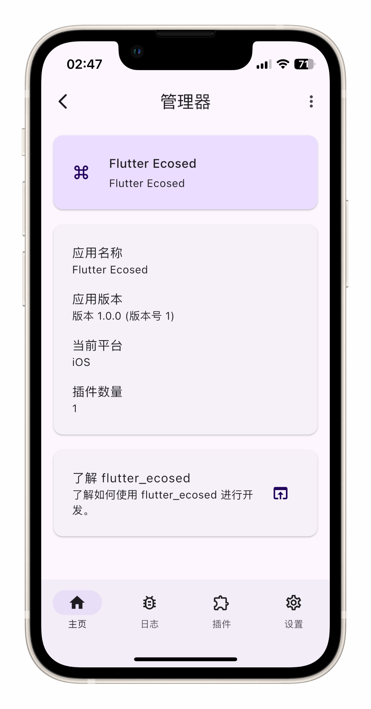

# flutter_ecosed

FlutterEcosed 是一个 Flutter 插件，也是一个高级的 Flutter 开发框架，提供 Android 平台调试、插件化开发和仪表盘等功能。

FlutterEcosed is a Flutter plugin and an advanced Flutter development framework that provides Android platform debugging, plugin development and dashboard functions.

## Getting Started

This project is a starting point for a Flutter
[plug-in package](https://flutter.dev/developing-packages/),
a specialized package that includes platform-specific implementation code for
Android and/or iOS.

For help getting started with Flutter development, view the
[online documentation](https://flutter.dev/docs), which offers tutorials,
samples, guidance on mobile development, and a full API reference.

